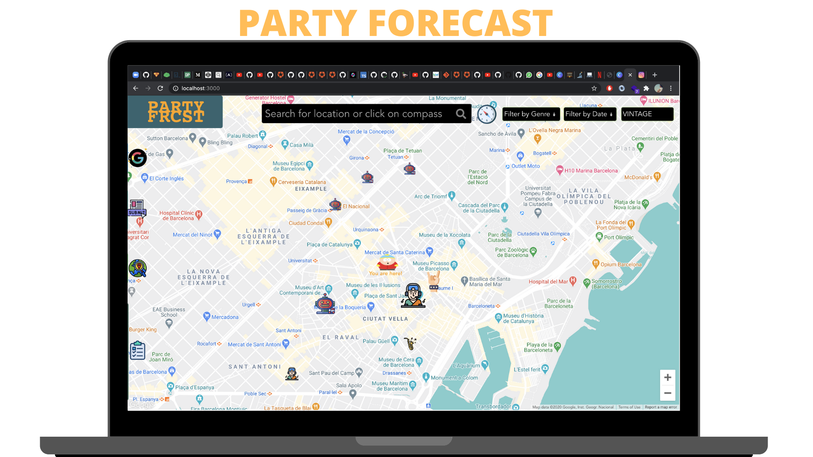

# THE PARTY FORECAST APP

Find & Host Parties around you on an interactive google maps interface.
Filter by Genre, date, change themes and search for locations all over the world.
Find out where the biggest party is happening in a genre of your choice, on a day you prefer.
No more endless searching on Facebook Events, dodgy websites, PART FORECAST is all you will ever need.




## Features

<p>
Create a Party for free with the basic details such as venue, genre of music, name of the artists performing, link to social media and also upload images of the event for potential party-goers
</p>

<p>
Search any location on the interactive google maps interface, find out more details by clicking on the marker and vote if you're going to the party or not. The most popular parties have the biggest icons making it easy for the user to decide.
</p>


## Project Presentation

The App was built by me within the space of a week.

Click on the thumbnail below to see the presentation:

<p align="center">
<a href="https://www.youtube.com/watch?v=V-lVwIJZkn8"></a>
</p>

## Getting Started

1. Clone the repo and open in your code editor of choice

```
git clone https://github.com/MohammedAK1991/PARTY-FORECAST.git
```

2. Install dependencies

```
cd client
npm install
cd server
npm install
```
3. Run MongoDB locally

```
brew services start mongodb- (for MAC + mongoDB-community)
sudo service mongodb start(for WINDOWS)
```
4. Start Server

```
cd server
node server.js
```


5. In the root, create a .env file with the following variables:
```
REACT_APP_GOOGLE_MAPS_API_KEY= <your api key goes here>
REACT_APP_CLOUDINARY_NAME=<your cloudinary collection name goes here>
```

6. Start the application on localhost

```
cd client
npm start
```

## API Keys

For this demo to work, please create a Google Map API Key (you will need to enable billing) and ensure that the two services below are enabled... otherwise it won't work!
- Maps JavaScript API
- Places API
- Geocoding API
 This API key must be in a .env.local file `REACT_APP_GOOGLE_PLACES_API_KEY`.
Furthermore you will also need to get an API key from  [Cloudinary](https://cloudinary.com/?utm_source=google&utm_medium=cpc&utm_campaign=Rbrand&utm_content=394051365970&utm_term=cloudinary%20api&gclid=CjwKCAjwnK36BRBVEiwAsMT8WAz9WKB1C4n0cmtnGLSslSEoWPs446ZHCnFywmUBc1_QPjvhjmoduBoCa1IQAvD_BwE)
Please check the .env.local.example file to see what the .env file will look like


## Tech-Stack


### Frontend

- [React](https://reactjs.org)
- [Google Maps React](https://www.npmjs.com/package/@react-google-maps/api)
- [Google Places React](https://www.npmjs.com/package/use-places-autocomplete)
- [Reach Combobox](https://reacttraining.com/reach-ui/combobox/)
- [Semantic UI](https://semantic-ui.com/)
- [Snazzy Maps](https://snazzymaps.com/style/8097/wy)

### Backend

- [Node.js](https://nodejs.org/)
- [Express](https://expressjs.com)
- [MongoDB](https://www.mongodb.com)
- [Mongoose](https://mongoosejs.com)


### Authentication

- [Google Auth2.0](https://developers.google.com/identity/protocols/oauth2)

### APIs

- [Google APIs](https://developers.google.com/apis-explorer)
- [Cloudinary for image upload](https://cloudinary.com/?utm_source=google&utm_medium=cpc&utm_campaign=Rbrand&utm_content=394051365970&utm_term=cloudinary%20api&gclid=CjwKCAjwnK36BRBVEiwAsMT8WAz9WKB1C4n0cmtnGLSslSEoWPs446ZHCnFywmUBc1_QPjvhjmoduBoCa1IQAvD_BwE)
- [Browser Geolocation](https://developer.mozilla.org/en-US/docs/Web/API/Geolocation_API)

## Observations

### Room For Improvement
* Extensive testing (>70% Coverage) with Jest and Jasmine
* Add functionality to get directions to a location within the map
* Improve handling of edge cases for better efficiency
* Fix minor CSS glitches
* Complete responsiveness on mobile platforms

## Contributing

Improvements are welcome 🙂

Fork the repo and do your thing. Push to your fork and submit a pull request.


